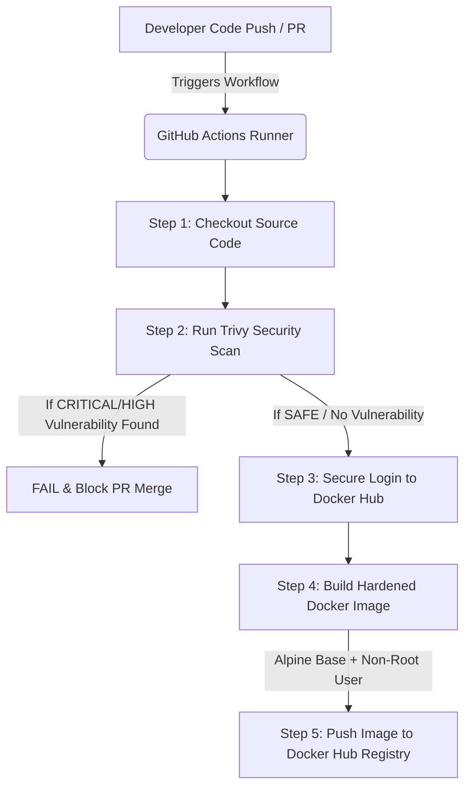

# 🛡️ Automated Secure Containerized CI/CD Pipeline

A production-ready DevSecOps pipeline built with **GitHub Actions**, **Trivy Security Scanner**, and **Docker** to implement Shift-Left security standards for a Node.js application.

## 📊 Pipeline Architecture Diagram

## 🏗️ Architecture & Workflow
1. **Developer Push / PR:** Code change triggers the GitHub Actions workflow on the `main` branch.
2. **SCA Security Scan:** **Trivy** executes a File System (`fs`) scan on `package.json` to catch critical/high vulnerabilities and hardcoded secrets before containerization.
3. **Docker Login:** Authenticates securely with Docker Hub using encapsulated **GitHub Repository Secrets**.
4. **Image Hardening & Push:** Builds a secure Docker image using an optimized **Alpine base image** and configures a **Non-Root User (`USER node`)** to mitigate privilege escalation risks, then pushes it to Docker Hub.

## 🛠️ Tech Stack & Tools
- **Automation:** GitHub Actions (CI/CD)
- **Security Scanner:** Aqua Security Trivy
- **Containerization:** Docker (Multi-stage & User Hardening)
- **Environment:** Linux (WSL / Ubuntu-latest Runner)
- **Backend Framework:** Node.js / Express
